# 🚀 Laravel CI/CD Setup on cPanel

 

Dokumentasi lengkap langkah demi langkah untuk mengatur **Continuous Integration & Deployment (CI/CD)** otomatis menggunakan **GitHub Webhooks** di **shared hosting cPanel**. Karena keterbatasan keamanan pada shared hosting yang sering kali menonaktifkan fungsi eksekusi PHP (seperti `exec`, `shell_exec`, `system`), sistem ini menggunakan pendekatan **"Cron Job Flag System"**. Pendekatan ini memisahkan pemicu (webhook) dari eksekutor (cron job) untuk memastikan deployment berjalan aman dan reliabel tanpa melanggar restriksi hosting.

> **⚠️ Catatan Penting:** Dokumentasi ini menggunakan **Cron Job Flag System** karena shared hosting cPanel umumnya mendisable execution functions (`exec`, `shell_exec`, `system`, `passthru`) untuk security.

---

## 📖 Quick Overview

- ✅ Setup Composer lokal di cPanel
- 🔐 Integrasi SSH Key dengan GitHub
- 🧰 Auto deploy script (`deploy.sh`)
- 🪝 GitHub Webhook handler (`deploy.php`)
- ⏱️ Cron Job untuk pengecekan flag deployment
- 🔄 Zero-downtime deployment dengan Laravel Maintenance Mode
- 🧹 Otomatisasi optimasi Laravel (cache clear, migrate, optimize)
- 📝 Logging lengkap untuk monitoring
- 🛡️ Security hardening (.htaccess + token)
- 📊 Monitoring logs dan troubleshooting

---

## 🧱 Struktur Panduan

| Tahap | File                                                          | Deskripsi                          |
| ----- | ------------------------------------------------------------- | ---------------------------------- |
| 1     | [01-prerequisites.md](docs/01-prerequisites.md)               | Persiapan & kebutuhan sistem       |
| 2     | [02-server-preparation.md](docs/02-server-preparation.md)     | Konfigurasi server cPanel awal     |
| 3     | [03-ssh-setup.md](docs/03-ssh-setup.md)                       | Setup SSH Key untuk GitHub         |
| 4     | [04-clone-repository.md](docs/04-clone-repository.md)         | Clone repository Laravel ke cPanel |
| 5     | [05-laravel-setup.md](docs/05-laravel-setup.md)               | Konfigurasi Laravel di production  |
| 6     | [06-deploy-script.md](docs/06-deploy-script.md)               | Membuat script otomatisasi deploy  |
| 7     | [07-webhook-handler.md](docs/07-webhook-handler.md)           | Membuat webhook receiver PHP       |
| 8     | [08-cron-job-setup.md](docs/08-cron-job-setup.md)             | Setup Cron Job di cPanel           |
| 9     | [09-github-webhook-setup.md](docs/09-github-webhook-setup.md) | Konfigurasi GitHub Webhook         |
| 10    | [09-security.md](docs/09-security.md)                         | Konfigurasi keamanan production    |
| 11    | [10-testing-deployment.md](docs/10-testing-deployment.md)     | Testing end-to-end deployment      |
| 12    | [11-testing-monitoring.md](docs/11-testing-monitoring.md)     | Monitoring & troubleshooting       |
| 13    | [13-faq.md](docs/13-faq.md)                                   | Pertanyaan umum                    |
| 14    | [SUMMARY.md](docs/SUMMARY.md)                                 | Daftar isi lengkap dokumentasi     |

---

## ⚙️ Panduan Instalasi Singkat

### Tahap 1: Persiapan Keamanan (SSH)

1.  Generate SSH Key di cPanel: `ssh-keygen -t rsa -b 4096 -C "cpanel-deploy"`.
2.  Pasang Public Key (`.pub`) ke **GitHub Repository \> Settings \> Deploy Keys**.
3.  Test koneksi: `ssh -T git@github.com`.

### Tahap 2: Konfigurasi Skrip

1.  **`public/deploy.php`**: Upload file ini agar bisa diakses publik. Atur `SECRET_TOKEN` yang kuat.
2.  **`deploy.sh`**: Letakkan di root project (jangan di folder public). Beri izin eksekusi: `chmod +x deploy.sh`.
3.  **`cron-deploy.sh`**: Skrip perantara untuk cron job. Beri izin eksekusi: `chmod +x cron-deploy.sh`.

### Tahap 3: Setup Automation

1.  **GitHub Webhook**: Setting Payload URL ke `https://domain-anda.com/deploy.php?token=TOKEN_RAHASIA`.
2.  **cPanel Cron Job**: Tambahkan job baru `* * * * * /path/to/cron-deploy.sh >> /path/to/logfile.log 2>&1`.

_(Lihat dokumen teknis lengkap untuk isi detail setiap skrip)_

---

## 🖥️ Contoh Penggunaan (Usage)

### 1\. Memicu Deployment (Normal Flow)

Developer hanya perlu melakukan standar git workflow.

```bash
git add .
git commit -m "feat: menambahkan fitur halaman kontak"
git push origin main
```

_Tunggu \~1-2 menit. Perubahan akan otomatis tampil di website live._

### 2\. Monitoring Deployment

Untuk memantau proses yang sedang atau telah berjalan, Anda dapat melihat file log di server melalui SSH atau File Manager cPanel:

| Jenis Log       | Lokasi File                     | Fungsi                                                     |
| :-------------- | :------------------------------ | :--------------------------------------------------------- |
| **Webhook Log** | `~/public_html/webhook.log`     | Mencatat request yang masuk dari GitHub.                   |
| **Cron Log**    | `~/public_html/cron-deploy.log` | Mencatat kapan cron mendeteksi flag.                       |
| **Deploy Log**  | `~/public_html/deployment.log`  | Mencatat output detail proses `git pull`, `composer`, dll. |

**Contoh cara cek live log via SSH:**

```bash
tail -f ~/public_html/deployment.log
```

---

## 🚨 Troubleshooting Umum

| Masalah                                         | Kemungkinan Penyebab                                     | Solusi                                                            |
| :---------------------------------------------- | :------------------------------------------------------- | :---------------------------------------------------------------- |
| **Webhook 403 Forbidden**                       | Token salah atau IP diblokir `.htaccess`.                | Cek kembali `SECRET_TOKEN` di GitHub dan server.                  |
| **Tidak ada deploy meski webhook 200 OK**       | Cron job mati atau salah path.                           | Cek status Cron Job di cPanel dan pastikan path file `.sh` benar. |
| **Git Pull Permission Denied**                  | SSH Key di server tidak valid/belum terdaftar di GitHub. | Cek ulang Deploy Keys di repo GitHub Anda.                        |
| **Error 500 saat akses website setelah deploy** | Masalah permission folder `storage`.                     | Jalankan `chmod -R 775 storage` via SSH.                          |

---

## ⚙️ Struktur Folder

```
/home/username/
├── .ssh/
│   ├── id_rsa_deploy       # 🔑 Private Key untuk akses GitHub
│   └── config              # Konfigurasi koneksi SSH Git
├── public_html/            # 📁 Root direktori project Laravel
│   ├── deploy.sh           # 📜 Skrip utama deployment (Bash)
│   ├── cron-deploy.sh      # 🕒 Skrip pengecek flag untuk Cron
│   ├── deploy.flag         # 🚩 File penanda (muncul hanya saat antri deploy)
│   ├── .env                # Konfigurasi environment production
│   └── public/
│       ├── .htaccess       # Security rules (melindungi deploy.php)
│       └── deploy.php      # 📡 Webhook listener (PHP)
└── logs/                   # (Opsional) Direktori log terpusat
```

---

## 🏗️ Arsitektur & Alur Kerja

Sistem ini bekerja dengan alur "Flagging" untuk mengakali batasan shared hosting.

```mermaid
graph TD
    A[🧑‍💻 Developer Push Code] -->|git push| B(GitHub Repo)
    B -->|Trigger| C{Webhook}
    C -->|POST Request| D[Server: deploy.php]
    D -->|Validasi Token & Branch| D
    D -->|Buat File| E[/📄 deploy.flag/]
    F[🕒 Cron Job cPanel] -->|Cek tiap menit| E
    E -.->|Jika ada| G[🚀 Eksekusi: deploy.sh]
    G -->|Git Pull & Optimize| H[✅ Aplikasi Terupdate]
    G -->|Hapus File| E
```



**Penjelasan Alur:**

1.  **Trigger:** Developer melakukan push ke GitHub.
2.  **Signal:** GitHub mengirim sinyal ke `deploy.php` di server.
3.  **Flagging:** `deploy.php` memverifikasi sinyal, lalu membuat file kosong bernama `deploy.flag`.
4.  **Execution:** Cron job (berjalan tiap menit) mendeteksi adanya `deploy.flag`, lalu menjalankan skrip bash `deploy.sh` yang berisi perintah deployment sesungguhnya.

---

## ⚖️ Lisensi

Distribusi bebas di bawah lisensi [MIT](LICENSE).

> Dokumentasi ini menguraikan implementasi sistem **Continuous Deployment (CD)** otomatis untuk aplikasi **Laravel** pada lingkungan **cPanel (Shared Hosting).** Tujuannya adalah menetapkan standar **_deployment yang aman, terstruktur, dan efisien_**, bahkan dalam kondisi resource hosting yang terbatas.

---
